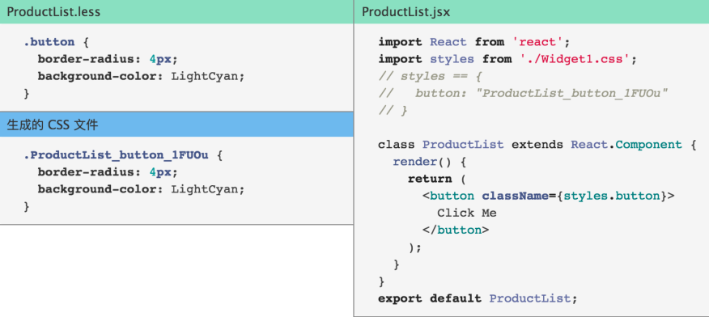

# Ant Design Note

Update: Ant Design 后来官方出了一个教程，笔记放在一个单独的 repo 中 - <https://github.com/baurine/antd-course-study>

## References

- [Ant Design of React](https://ant.design/docs/react/introduce-cn)
- [Dva Knowledge Map](https://github.com/dvajs/dva-knowledgemap)

## Note

### Ant Design

把 Ant Design 官网上的内容都看了并跟着做了一些练习。明白了 Ant Design 是干嘛用的，以及怎么用，没以前想的那么复杂。

首先，Ant Design 是一套完整的设计规范，你可以理解成另一个 Material Design，但风格是迥异的。

这些规范包括：设计原则，色彩，图标，字体，文案，布局，导航 ... 等诸如此类。

像 Material Design 刚推出的时候，只有规范，没有实现，没有可以直接拿来直接用的组件，大伙只好自己实现，后来才逐渐有了官方实现的 Android Material Design 组件库 (但是到目前为止好像也不全，好多组件都是第三方实现的)。

而 Ant Design 基于它们的设计规范，一开始就提供了一套完整的可以直接使用的组件，基于 React 实现。可以理解成类似 Twitter 的 Bootstrap。包括 js 和 css 两部分。

(其实这才是我们程序员最关心的部分!)

那怎么在我们的项目中用上这套组件呢，虽然文档上介绍了 antd-init, dva-cli 等一堆工具，但其实真没那么复杂，就把它理解成一个普通的第三方组件库。

1.  在项目中添加 antd 库

        $ npm install antd -g
        // or
        $ yarn add antd

1.  在项目中使用 antd 提供的组件

         import { DatePicker } from 'antd'
         ReactDOM.render(<DatePicker />, mountNode)

    同时要在 js 中引入相应的 css 文件

         import 'antd/dist/antd.css'

上面使用 `import { DatePicker } from 'antd'`，会导致将整个 antd 库的代码都包含进来，但实际我们只需要导入 DataPicker 的部分代码，因此我们需要按需加载来减小最后生成的文件体积。

按需加载有两种方式：

1.  使用 `babel-plugin-import` 组件 (推荐)，使用略。
1.  手动按需加载，换一种引入方法，如下所示：

        import DatePicker from 'antd/lib/date-picker'  // 加载 JS
        import 'antd/lib/date-picker/style/css'        // 加载 CSS

### dva

文档还介绍了 dva，其实也不要把它想得太复杂，就是阿里他们把 react + redux + redux-saga + react-router 封装出来的一套方便我们使用的前端框架，可以想象成类似后端 rails 的东西。dva 是框架，dva-cli 是它的命令行工具。

看了一下 dva 的用法，貌似确实可以简化不少 redux 的使用。

dva 和 Ant Design 是没有关系的，Ant Design 就是一套单独的 UI 组件库，它是可以单独使用的。

用了 dva 后，你就可以不用手动写 redux 的那些模板代码了。

### Ant Desgin Pro

使用 dva 作为代码框架，Ant Design 作为 UI 组件的一套完整的开箱即用的后台管理程序。

Ant Desgin Pro = dva + Ant Desgin

关于权限，控制左侧导航栏对哪些用户可见，需要在登录之后调用 setAuthority() 设置用户的类型，然后再调用 reloadAuthorized() 将用户的类型更新到内存中。

- [Ant Design Pro 总结篇](http://blog.poetries.top/2018/09/16/ant-design-pro/)

### Miscs

**CSS Modules**

从 [Dva Knowledge Map](https://github.com/dvajs/dva-knowledgemap) 这篇文章中理解了 CSS Modules 的原理。

### 使用经验

Form / Table 重度使用。

TODO
