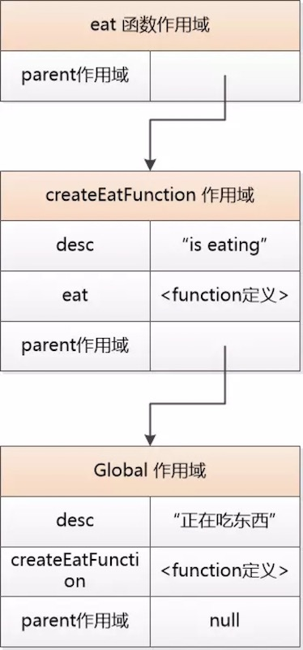

# Basic

记录一些 JavaScript 的基础知识。

- 闭包
- 立即执行函数 (IIFE)
- this
- var / let / const
- ES6 中 let/const 的临时死区
- 理解 JS 的单线程
- JS 方法参数，是传值还是传引用?

## Note 1

### 闭包

2017/7/30

资料：

1. [Javascript 王国之函数教主 - 刘欣](https://mp.weixin.qq.com/s?__biz=MzAxOTc0NzExNg==&mid=2665513789&idx=1&sn=e2e39002a915291fa06050c8116c2f96)
1. [图解 Javascript 上下文与作用域](http://blog.rainy.im/2015/07/04/scope-chain-and-prototype-chain-in-js/)

示例代码：

    // 用函数作为返回值
    function createEatFunction() {
      var desc = " is eating"
      function eat(animal) {
        console.log(animal.name + desc)
      }
      return eat
    }

    var eat = createEatFunction() // 生成函数 (其实是生成闭包)

    var desc = "正在吃东西"

    eat(dog) // 输出 "... is eating"，而不是 "... 正在吃东西"，也不是 desc undefined

简而言之，闭包就是带有上下文的函数，因此，它不是一个纯粹的函数。如果用面向对象的思维来理解，比如想象 Java 会怎么做，它应该是返回一个对象，这个对象里包含 desc 这个成员变量和 eat() 函数。C++ 中有一种对象叫函数对象，我觉得是类似闭包的作用。

然后关键是这个闭包中的上下文中什么呢？

上面这段代码，如果你用 c/c++/java 的思维去理解的话，会感觉程序得不到正确结果。因为在 createEatFunction() 执行完之后，函数内的 desc 作为栈上的值，会被从栈中弹出，它的值不再可用。

比如下面这段代码就是常在 c/c++ 犯的错误，在函数中返回了栈上的对象的指针。

    #include <stdio.h>
    #include <string.h>

    char* get_str() {
      char s[5] = "str1";
      return s;
    }

    int main() {
      char* s1 = get_str(); // get_str() 执行完后，s[5] = "str1" 的值被清栈，因此此处 s1 的值是随机值
      printf("%s", s1);
      printf("%d", strlen(s1));

      char s2[5] = "str2";
      printf("%s", s2);
      printf("%d", strlen(s2));
    }

但是 js 中，如果在函数中作为返回值的函数，它引用了自身以外的变量，那么这个变量会被保存下来，相当于保存了现场。实际上因为 js 的函数有自己的作用域，这里相当于是把外层函数的作用域保存了下来。

简化的示例图：

JavaScript 中函数是一等公民，既可以直接作为参数传参，也可以作为作为返回值，使用起来非常灵活。我很久以后才意识到，这种灵活性和能力是很多传统语言不具备的。

比如 c/c++，指针是一等公民 (可以这么说吧)，虽然也可以将函数指针为作参数传参，但由于不能在函数中声明新的函数 (印象中是不行，不知道新的标准可不可以了)，所以将函数指针作为返回值也没有什么意义。而 Java，我很久以后才意识到，它连用函数作为参数都不行，连回调函数都要包装在对象中 (一般是接口对象)，一切都要包装在对象中，难怪人们说它啰嗦。

我觉得 JS 的闭包，更重要的作用是生成不同的作用域。因为同一个函数生成的闭包，这些闭包中的函数应该是共享一份的，因为是代码嘛，只有作用域中的变量是不一样的，所以相同类型闭包之间，不同的是作用域中的值，相同的是执行代码，即返回的函数。

还以上面的示例代码作为例子，给它加一个参数：

    function createEatFunction(food) {
      var desc = " is eating "
      function eat(animal) {
        console.log(animal.name + desc + food)
      }
      return eat
    }

    var eat1 = createEatFunction("bone")
    var eat2 = createEatFunction("fish")

上面 eat1 和 eat2 是相同类型的闭包，它们的执行代码是一样的，即 eat() 函数，但上下文，即保存的作用域是不一样的，一个 food 引用的 "bone"，另一个是 "fish"。

### 立即执行函数 (IIFE)

2017/7/30

为什么需要立即执行函数。

资料：

1. [深入理解 JavaScript 系列（4）：立即调用的函数表达式](http://www.cnblogs.com/TomXu/archive/2011/12/31/2289423.html)
1. [JS 作用域与块级作用域](http://blog.csdn.net/huli870715/article/details/6531664)

JS 中的立即执行函数 IIFE (Immediately-Invoke Function Expression)：

    var counter = (function(){
      var i = 0;
      return {
          get: function(){
              return i;
          },
          set: function(val){
              i = val;
          },
          increment: function(){
              return ++i;
          }
      }
    }());

    counter.get();       // 0
    counter.set(3);
    counter.increment(); // 4
    counter.increment(); // 5

我的一些理解，IIFE 相当于一个只执行了一次且只能执行这一次的匿名函数，它返回了一个全局唯一的闭包。比如上例中的 counter，你不能再得到第二个 counter，因为生成它的匿名函数不能再执行第二遍。这样，在写库的时候，就可以用这种方式来生成一个唯一的全局对象。能想象 jquery 可能是这么实现的：

    var $ = (function() {

      ...
      function css(...) {
        ...
      }

      function select(selector) {

      }

      return select;

    }());

    // 使用
    $('#root').css(...)

IIFE 的好处，本质是源于 JavaScript 早期没有模块管理，没有块作用域的缺陷导致的。它只有函数作用域和全局作用域。

什么是块作用域：任何一对括号 `()` 和花括号 `{}` 中的语句集都属于一个块，在这之中定义的所有变量在代码块外都是不可见的。

函数作用域：定义在函数中的参数和变量在函数外部是不可见的。

以 c/c++/java 为例，它们有块作用域：

    #include <stdio.h>
    void main() {
      int i=2;
      i--;
      if (i) {
        int j=3;
      }
      printf("%d/n",j); // 运行得到错误，j undefined
    }

js：

    function test(){
      for(var i=0;i<3;i++){
      }
      console.log(i)  // 输出 3，可以访问到 i
    }
    test();

可见 js 不支持块级作用域，它只支持函数作用域，而且在一个函数中的任何位置定义的变量在该函数中的任何地方都是可见的。

解决办法，如果你想让 `()` 中的值不被外界访问，把这一部分逻辑放到 IIFE 中：

    function test() {
      (function () {
        for(var i=0;i<4;i++){
        }
      })();
      console.log(i)  // i undefined
    }
    test();

但就这里而言，没有什么必要。

如果 js 支持模块管理，其实我认为没有块级作用域也不是什么大问题。但是没有模块管理，又没用块级作用域，那就是大问题了。

(?? 模块是不是一种更大的块级作用域，比 `()` 和 `{}` 还大，文件级别，如果是的话，那上面这句话就当我没说。)

对于 c/c++/java 来说，它们有一个文件级别的作用域。即使有定义在函数以外的变量，对于 c/c++ 来说，如果你没有在 `.h` 中声明它，对于 java 来说，如果你没有用 public 声明它，那么它就不能被其它文件所访问到。

一个 c 的例子：

    // b.h
    void bar();

    // b.c
    #include "b.h"
    #include <stdio.h>

    static int foo = 6;

    void bar() {
      printf("%d\n", foo);
    }

    // a.c
    #include "b.h"
    #include <stdio.h>

    static int foo = 5;

    int main() {
      printf("%d\n", foo);
      bar();
    }

    $ gcc b.c a.c
    $ ./a.out
    5
    6

a.c 和 b.c 中都定义 foo 变量，但并没有冲突。而且如果你在 b.c 中定义一个 `static int foo2 = 7;`，在 a.c 中是无法直拉使用的，编译就通不过，除非你在 `b.h` 中声明 foo2。

但是对于 js 来说，因为没有模块管理，任何函数以外的变量都会变成全局变量 (这里指在 let/const 被引入之前，用 var 声明的变量)，而不是只在文件内生效。如果有多个 js 文件，它们有同名的全局变量，就会有冲突。这就是所谓的全局污染吧。比如 a.js 和 b.js 中都定义了 `var foo` 这个变量，那么先加载的 foo 就会被后加载的 foo 所覆盖掉。

但是自从 js 引入了模块管理和 let/const 之后，这个问题就不存在了。用 let/const 声明的变量具有块级作用域及文件级别的作用域，不会造成全局污染。只有在 js 文件中被显式 export 的变量和函数，才能在其它 js 文件中被 import/require 后使用。

(这个地方我还要做一些实验，有了模块管理后，函数外用 var 声明的变量，到底是全局的，还是文件模块内的? 用 node 做的实验结果是，用 var 声明的变量不再是全局变量，而是文件模块内的变量。但在 chrome 中，用 var 声明的变量，仍然是全局的，用 let/const 不是全局变量，详情见下面的 **var / let /const** 小节)。

但在这之前，解决全局污染的办法就是使用 IIFE，把整个 js 文件的代码包含在一个 IIFE 函数中，用显式的 return 来 export 所需要的变量和函数。

### this

2017/7/30

[图解 Javascript 上下文与作用域](http://blog.rainy.im/2015/07/04/scope-chain-and-prototype-chain-in-js/)

this 的值，概括起来很简单，就是一句话，当前函数执行在哪个对象上，这个 this 就指向哪个对象。

话是很简单，但问题的关键是，使用的时候，会很容易不知道或是混淆这个函数到底执行在哪个对象上。

容易区分的例子 (以下例子皆来自上面的链接文章中)：

(注意，下面的例子中定义变量用的都是 var，函数外用 var 定义的变量是全局变量，如果用 let/const 定义的变量，不是全局变量，而是文件内的块级变量，而且下面的代码只在浏览器中生效，用 node 运行得不到预期结果，因为在 node 中，因为有了模块管理，var 定义的不再是全局变量，除非显示地把它绑定到 global 上，比如 `global.x = 1`)。

    var x = 1;
    var f = function(){
      console.log(this.x);
    }
    f();  // -> 1，this 指向 global

    var ff = function(){
      this.x = 2;
      console.log(this.x);
    }
    ff(); // -> 2，this 指向 global，因此 this.x 改变了全局的 x
    x     // -> 2

    var o = {x: "o's x", f: f};
    o.f(); // "o's x"，this 指向对象 o，或者说 this 被绑到了对象 o 上

不容易区分的例子，尤其是和闭包一起用的时候：

    var name = "global";
    var oo = {
      name: "oo",
      getNameFunc: function(){
        return function(){
          return this.name;
        };
      }
    }
    oo.getNameFunc()();  // -> "global"，this 指向 global，并不是 oo

这是因为上面这句 `oo.getNameFunc()()` 实际等价于：

    getName = oo.getNameFunc();
    getName();  // -> "global"，this 指向 global

为了避免闭包中的 this 在执行时被替换，可以采取的几种方法。

显式保存原来的 this 对象：

    var name = "global";
    var oooo = {
      name: "ox4",
      getNameFunc: function(){
        var self = this;
        return function(){
          return self.name;
        };
      }
    };
    oooo.getNameFunc()(); // -> "ox4"

显式 bind 对象到 this 上：

    var name = "global";
    var oo = {
      name: "oo",
      getNameFunc: function(){
        return function() {
          return this.name;
        };
      }
    }
    oo.getNameFunc()();  // -> "global"
    oo.getNameFunc().bind(oo)(); // -> "oo"

然后再说一说 ES6 的箭头函数，它改善了容易把 this 用错的情况。

[箭头函数 - 廖雪峰](https://www.liaoxuefeng.com/wiki/001434446689867b27157e896e74d51a89c25cc8b43bdb3000/001438565969057627e5435793645b7acaee3b6869d1374000)

简单地说：

> 箭头函数看上去是匿名函数的一种简写，但实际上，箭头函数和匿名函数有个明显的区别：箭头函数内部的 this 是词法作用域，由上下文确定。

这里词法作用域，指的是在哪个对象上定义了这个箭头函数，这个箭头函数中的 this 就指向谁。这相当于是说，this 是在箭头函数被定义时就已经明确了，而不像以前，this 是在执行时被动态决定的。

下面的例子来自廖雪峰的文章：

    var obj = {
        birth: 1990,
        getAge: function (year) {
            var b = this.birth; // 1990
            var fn = (y) => y - this.birth; // this.birth仍是1990
            return fn.call({birth:2000}, year);
        }
    };
    obj.getAge(2015); // 25

由于箭头函数的 this 在被定义时就已经明确，所以像 `fn.bind()` `fn.call()` `fn.apply()` 这些可以用来动态改变 this 绑定的方法中的 this 参数就不再有意义了。

[关于箭头函数 this 的理解几乎完全是错误的](https://github.com/ruanyf/es6tutorial/issues/150)

> > 所有的箭头函数都没有自己的 this，都指向外层。

> 这句话就是箭头函数的精髓。

> > "箭头函数" 的 this，总是指向定义时所在的对象，而不是运行时所在的对象。

> 这一句说的太模糊了，最好改成，总是指向所在函数 (即箭头函数的外层) 运行时的 this。

[箭头函数 - MDN](https://developer.mozilla.org/zh-CN/docs/Web/JavaScript/Reference/Functions/Arrow_functions)

> 箭头函数会捕获其所在上下文的  this 值，作为自己的 this 值，因此下面的代码将如期运行。

    function Person() {
        this.age = 0;
        setInterval(() => {
            // 回调里面的 `this` 变量就指向了期望的那个对象了
            this.age++;
        }, 3000);
    }

    var p = new Person();

2017/8/18，在公司做了关于 javascript 的分享，对 javascript 中普通函数和箭头函数的 this 又有了更清晰的理解。其中的关键点在于，this 只在函数中有意义，因为它在函数中，是指向函数运行时所在的对象。在普通的 Object 中没有意义，或者说和这个 Object 没有关系，在普通的 Object 中 this 指向 global。

理解了这一点，我们就能很容易理解下面这个例子了 (我以前是非常不能理解的)。

    this.cnt = 100
    const counter = {
      cnt: 50,
      foo: this.cnt,
      inc: () => console.log(this.cnt) // what's the this point to?
    }

    console.log(counter.foo)  // 100
    counter.inc()             // 100

输出结果都是 100，证明上例中 counter 这个对象中的 this 是指向 global 的，因此在对象中直接定义的箭头函数中的 this 也指向 global。

再来看这个例子：

    this.cnt = 100
    const counter = {
      cnt: 50,
      inc: function() {
        console.log(this.cnt)
        setTimeout(() => console.log(this.cnt), 1000)
      }
    }

    counter.inc()  // 50 50

此例中，两个输出都是 50，说明函数中的 this，即普通函数和箭头函数中的 this，都指向 counter 对象。首先，第一个 this 指向 counter 是很好理解的，因为 `counter.inc()`，inc() 运行在 counter 对象上。那为什么第二个 this 也指向 counter 呢，因为第二个 this 所处的箭头函数，它在 inc() 函数中定义，因此它往外找 this 的时候，马上就找到了 inc() 中的 this，而 inc() 中的 this 是指向 counter 对象的，所以箭头函数中的 this 也指向 counter 对象。

[箭头函数中 this 的用法](https://github.com/zhengweikeng/blog/issues/11)

### var / let / const

前面说道，因为 var 定义的变量没有块级作用域，所以导致了各种问题和各种 hacky 的做法。于是，从 ES6 开始，引用了 let/const 来解决这个问题。简单地说，let/const 定义的变量具有块级作用域，let 定义的是变量，const 定义常量。

    function test(){
      for(var i=0;i<3;i++){
      }
      console.log(i)  // 输出 3，可以访问到 i
    }
    test();

    function test(){
      for(let i=0;i<3;i++){
      }
      console.log(i)  // i undefined，不再需要用 IIFE 来解决这个问题了
    }
    test();

在函数外用 let/const 定义的变量，不再绑定到全局对象上，因此不会造成全局污染。

在 chrome 中运行下面两段代码，进一步了解 var / let 的区别：

    var x = 1;  // x 绑定 global 上
    var f = function(){
      console.log(this.x);
    }
    f();  // -> 1，this 指向 global

    let x = 1;  // x 不再是全局变量
    var f = function(){
      console.log(this.x);
    }
    f();  // -> undefined，this 指向 global，但 x 并不在 global 上

但是如果用 node 来跑上面两段代码，得到的结果是一样的。因为对于 node 来说，函数外用 var 定义的也不再是全局变量，但函数内 var 还是没有块级作用域。

所以没有特殊的话，用 let/const 完全替代 var 吧。

### ES6 中 let/const 的临时死区

- [深入 Javascript 的 const、let 和块级作用域](https://juejin.im/entry/5ae14c08518825673d6d03f2)
- [[译] JavaScript 变量的生命周期：为什么 let 不存在变量提升](https://www.qcyoung.com/2016/08/03/%E3%80%90%E8%AF%91%E3%80%91JavaScript%20%E5%8F%98%E9%87%8F%E7%9A%84%E7%94%9F%E5%91%BD%E5%91%A8%E6%9C%9F%EF%BC%9A%E4%B8%BA%E4%BB%80%E4%B9%88%20let%20%E4%B8%8D%E5%AD%98%E5%9C%A8%E5%8F%98%E9%87%8F%E6%8F%90%E5%8D%87/)

我们常说 var 存在变量提升，在一个函数中任何地方用 `var varName` 声明的变量，实际执行时都会提升到函数的最开始执行，所以 var 没有块级作用域，它的作用域是函数。

在 ES6 中为 let/const 增加了块级作用域，它们仅在块级作用域内生效，因此它们声明的变量不会像 var 一样提升到函数的最开始执行。

但是，这里有一个很微小的细节。

平时我们在其它地方用 `typeof a` 访问一个没有声明或初始化的变量时，得到的输出是 `undefined`，直接访问一个没有声明的变量的值，如 `console.log(a)`，得到的输出是异常错误 `ReferenceError`，如果访问一个在后面用 var 声明的变量的值，则得到 `undefined` 的输出。

但是，如果进入一个块级作用域，去访问一个后面才用 let/const 声明的变量，无论是直接取它的值，如 `console.log(a)` 还是用 typeof 去访问它的类型，如 `typeof a`，得到的输出，都是异常错误 `ReferenceError`，因为这里存在一个临时死区的概念。

从某个变量所处的块级作用域的开始，到这个变量被 let/const 声明的这一段区域，称之为这个变量的临时死区。在这个死区内，这个变量无法被访问，无论是直接取值还是用 typeof 访问其类型。

示例代码：

    function test3() {
      try {
        console.log('-----test3');

        console.log('typeof a:', typeof a);
        console.log('a: ', a);

        let a = 5
        console.log('a:', a);
      } catch (error) {
        console.log(error);
      }
    }

更多示例代码见 [dead-zone.js](../codes/es6-dead-zone/dead-zone.js)。

### 理解 JS 的单线程

说到 JS 的单线程，很多人有误解，也有人表示不理解，我曾经也不很理解。尤其是 JavaScript 发起网络请求时，怎么可能在唯一的主线程中做呢，不会阻塞其它操作吗？

现在我是这么理解的，JS 的单线程指的仅仅是纯 JavaScript 代码运行所在的线程，只有一个线程，如果在浏览器中运行的 JavaScript 代码，你可以理解它为操作 DOM 的一种 UI 线程。据我所知的 GUI 程序，无论用什么语言写的，都只有一个 UI 线程。

JavaScript 虽然自身只有一个线程，但在底层，它是可以调用用其它语言写的模块的，比如网络请求，底层肯定是用 C/C++ 写的，HTML 5 中的 canvas，可以用 JavaScript 来操作它，但 canvas 本身就像是一个原生插件，它内部肯定也是用 C/C++ 写的，而这些语言是支持多线程的。因此，这些模块在内部是可以使用多线程，但当它们和 JavaScript 通信时，仅可以在 JavaScript 运行的线程上通信。

所以，整体上是这样的，JavaScript 代码运行时，只有一个线程，当它需要做一些复杂操作，必须交给第三方模块来实现的，它在 JavaScript 线程上启动第三方模块，调用它的接口，第三方模块内部可能使用多个线程来完成这个任务，但最终将结果返回给 JavaScript 时，它必须把结果通知到 JavaScript 线程上。

(深入学习一下 ReactNative 中 React 和 NativeModule 是怎么通信的。)

(调用第三方模块，也可以理解成，这些第三方模块实际是由浏览器实现的功能，由浏览器提供的接口，比如访问网络。JavaScript 调用这些由浏览器提供的 API 时，浏览器可能会通过其它线程来完成。)

换一个角度来理解，先不考虑用 node 实现的服务端。来看在浏览器中运行 JavaScript 的情况。(Chrome) 浏览器为每个 Tab 分配一个进程，每个进程中都有多个线程，其中就有一个 JavaScript 引擎线程，浏览器用这个线程来执行 JavaScript 代码，如果 JavaScript 代码中要执行那些非 JavaScript 能够实现的功能，它实际是调用浏览器提供的接口，然后由浏览器来启动其它模块实现，然后把结果再通知回 JavaScript 线程。

(那在 node 中是什么状况呢，有待进一步了解。)

[JavaScript 是单线程的深入分析](http://www.cnblogs.com/Mainz/p/3552717.html)

> JS 运行在浏览器中，是单线程的，每个 Window 一个 JS 线程，但浏览器不是单线程的，例如 Webkit 或是 Gecko 引擎，都可能有如下线程：
>  - JavaScript 引擎线程
>  - 界面渲染线程
>  - 浏览器事件触发线程
>  - Http 请求线程

> 其实 (Ajax) 请求确实是异步的，这请求是由浏览器新开一个线程请求...

### JS 方法参数，是传值还是传引用?

[Is JavaScript a pass-by-reference or pass-by-value language?](https://github.com/simongong/js-stackoverflow-highest-votes/blob/master/questions21-30/parameter-passed-by-value-or-reference.md)

[JavaScript 是传值调用还是传引用调用?](https://github.com/nodejh/nodejh.github.io/issues/32)

答案，既不是传值，也不是传引用，而是 call-by-sharing，也可以理解成传引用的值。

ruby / python / java 也是这样，完全理解。

例子：

    function changeStuff(a, b, c) {
      a = a * 10;
      b.item = "changed";
      c = {item: "changed"};
    }

    var num = 10;
    var obj1 = {item: "unchanged"};
    var obj2 = {item: "unchanged"};

    changeStuff(num, obj1, obj2);

    console.log(num);           // 10
    console.log(obj1.item);     // changed
    console.log(obj2.item);     // unchanged
