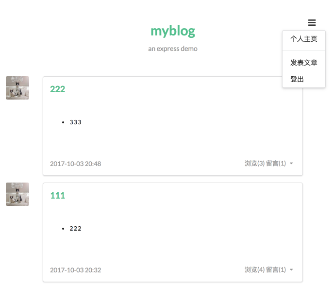
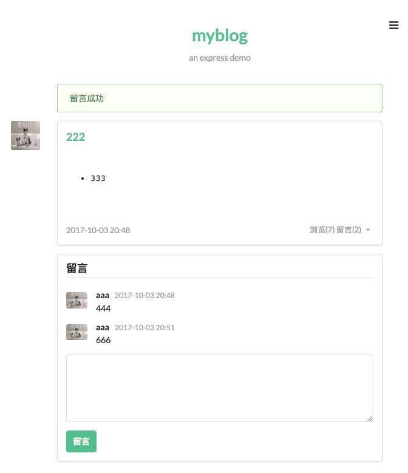

# Express Note

Resources:

- [N-blog](https://www.gitbook.com/book/maninboat/n-blog/details)
- [阮一峰 - Express 框架](http://javascript.ruanyifeng.com/nodejs/express.html)
- [Express](http://expressjs.com/)
- [Express 中文](http://expressjs.jser.us/guide.html)

## N-blog Note

N-blog Demo：

[N-blog Code](../code/myblog)

### 第 3 章 - 启动 Express

**3.1.1 supervisor**

用 supervisor 监控文件变化并自动重启 node：

    $ npm i -g supervisor
    // 重启 terminal
    $ supervisor --harmony index

**3.3.1 模板引擎**

从 express 3.0 起，废弃了内置 layout 和 partial 机制 (移出了 express，移动一个单独的包里了)，手动使用 `<%- include('layout_name') %>` 去包含其它 view。

示例：

    // views/users.ejs
    <%- include('header') %>
      <h1><%= name.toUpperCase() %></h1>
      
hello, <%= name %>

    <%- include('footer') %>

**3.4.1 中间件与 next()**

express 中的中间件 (middleware) 就是用来处理请求的，当一个中间件处理完，可以通过调用 next() 传递给下一个中间件，如果没有调用 next()，则请求不会往下传递，如内置的 res.render() 其实就是渲染完 html 直接返回给客户端，没有调用 next()，从而没有传递给下一个中间件。

    // index.js
    var express = require('express');
    var app = express();

    app.use(function(req, res, next) {
      console.log('1');
      next();
    });

    app.use(function(req, res, next) {
      console.log('2');
      res.status(200).end();
    });

    app.listen(3000);

通过 app.use 加载中间件，在中间件中通过 next() 将请求传递到下一个中间件，next() 可接受一个参数接收错误信息，如果使用了 next(error)，则会返回错误而不会传递到下一个中间件。

**3.4.2 错误处理**

    // 错误处理
    // 要作为最后一个中间件
    app.use(function(err, req, res, next) {
      console.error(err.stack);
      res.status(500).send('Something broke!');
    });

### 第 4 章 - Express 实战

**4.2 准备工作**

初始化目录：

    $ mkdir myblog
    $ cd myblog
    $ npm init
    $ mkdir public routes views models config lib
    $ touch index.js

目录结构：

- public - 存放静态文件，包括 css / img
- routes - 路由
- views - 视图
- models - 操作数据库数据
- config - 配置文件
- lib
- index.js - 入口

安装依赖：

    $ npm i config-lite connect-flash connect-mongo ejs express express-formidable express-session marked moment mongolass objectid-to-timestamp sha1 winston express-winston --save

- express: web 框架
- express-session: session 中间件
- connect-mongo: 将 session 存储于 mongodb，结合 express-session 使用
- connect-flash: 页面通知提示的中间件，基于 session 实现
- ejs: 模板
- express-formidable: 接收表单及文件的上传中间件
- config-lite: 读取配置文件
- marked: markdown 解析
- moment: 时间格式化
- mongolass: mongodb 驱动
- objectid-to-timestamp: 根据 ObjectId 生成时间戳
- sha1: sha1 加密，用于密码加密
- winston: 日志
- express-winston: 基于 winston 的用于 express 的日志中间件

**4.3 配置文件 config-lite**

config-lite 是一个轻量的读取配置文件的模块。config-lite 会根据环境变量 (`NODE_ENV`) 的不同从当前执行进程目录下的 config 目录加载不同的配置文件。如果不设置 `NODE_ENV`，则读取默认的 default 配置文件，如果设置了 `NODE_ENV`，则会合并指定的配置文件和 default 配置文件作为配置，config-lite 支持 .js、.json、.node、.yml、.yaml 后缀的文件。

    // config/default.js
    module.exports = {
      port: 3000,
      session: {
        secret: 'myblog',
        key: 'myblog',
        maxAge: 2592000000
      },
      mongodb: 'mongodb://localhost:27017/myblog'
    };

4.4 - 4.10，功能实现，略。

**4.11 404 页面**

在 route/index.js 最后一个路由后面加上 404 的处理：

    // route/index.js
    // 404 page
    app.use(function (req, res) {
      if (!res.headersSent) {
        res.render('404');
      }
    });

**4.12 错误页面**

在 index.js 中的 app.listen 前加上错误处理：

    // index.js
    // error page
    app.use(function (err, req, res, next) {
      res.render('error', {
        error: err
      });
    });

**4.13 日志**

使用 winston 和 express-winston 包记录访问和错误日志。

**4.15 部署**

使用 pm2 在生产服务器启动 node 程序。pm2 是 Node.js 下的生产环境进程管理工具，就是我们常说的进程守护工具，可以用来在生产环境中进行自动重启、日志记录、错误预警等等。

安装：

    $ npm i -g pm2

修改 package.json，增加 start 命令：

    "scripts": {
      "test": "node --harmony ./node_modules/.bin/istanbul cover ./node_modules/.bin/_mocha",
      "start": "NODE_ENV=production pm2 start index.js --node-args='--harmony' --name 'myblog'"
    }

通过 `npm start` 启动程序。

pm2 常用命令：

1. `pm2 list` - 列出 pm2 启动的程序
1. `pm2 start/stop [id|name]` - 启动停止某个 pm2 启动的程序
1. `pm2 reload/restart [id|name]`
1. `pm2 logs [id|name]`
1. `pm2 kill` - 退出 pm2 自身进程

**个人总结**

express 的 routes 是比较重量级的，主要逻辑都在 routes 里。express 里没有 controller，或者是 controller 是在 routes 里。而 rails 里 routes 是轻量的，主要逻辑在 controller 和 model 里。

本例用 sematic 作为 css 库，效果挺令我惊艳的。有必要学会一套 css 库，比如 bootstrap。
