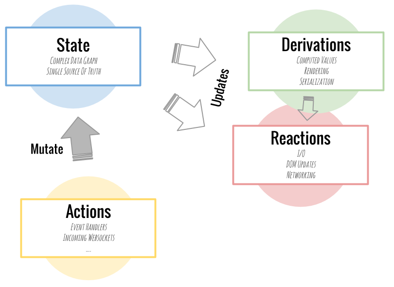

# MobX Note

## References

- [MobX 官方文档中文翻译](http://cn.mobx.js.org/)
- [MobX Egghead.io - Manage Complex State in React Apps with MobX](https://egghead.io/courses/manage-complex-state-in-react-apps-with-mobx)
- [MobX 和 React 十分钟快速入门 (翻译)](http://www.zcfy.cc/article/mobx-ten-minute-introduction-to-mobx-and-react-4306.html)

## Note

有了 Vue 和 Redux 的知识后，MobX 就变得很好理解了，有几个小时就足够了。

MobX + React 约等于 Vue。

MobX 的四个核心概念：

1. State

   状态，即数据，需要用 `mobx.observable(data)` 对原始数据进行包裹，使用变成 Observable 对象，当它的值发生变化时，会自动触发观察此数据的 Reactions。

   `mobx.observable(data)` 可以用 `@observable data` 来简化。

        var peopleStore = mobx.observable([
          { name: "Michel" },
          { name: "Me" }
        ]);
        // 等于
        @observable peopleStore = [
          { name: "Michel" },
          { name: "Me" }
        ]

   Redux 一般只用一个 State Store，但 MobX 一般使用多个 State Store。

1. Derivations

   通过 state 计算得到的值，用 @computed 声明。Derivations 应该是纯函数，没有副作用。

1. Reactions

   其实就是观察者 (监听者)，观察者监听 state 的变化，当变化产生时，观察者 (函数) 执行。Reaactions 执行有副作用的作务。

   用 autorun() 和 when() 来注册观察者，前者只要 state 有变化就执行观察者，后者，state 的变化必须满足一定条件才执行。

   mobx-react 提供了 observer() 函数和 @observer 装饰器，对 Component 使用 observer() 包裹和用 @observer 装饰器的效果是一样的，表示将这个 Component 的 render() 函数进行 autorun()，即将 render 函数注册为观察者，这样，当 @observable 的 state 发生变化时，Component 自动刷新渲染。

        const App = observer(({ temperature }) => (
          

            {temperature.temperature}
            <DevTools />
          

        ))

        @observer class TView extends React.Component {
          render() {
            const t = this.props.temperature
            return (
              <li onClick={this.onTemperatureClick}
              >
                {t.location}:
                {t.loading ? "loading.." : t.temperature}
              </li>
            )
          }

          @action onTemperatureClick = () => {
            this.props.temperature.inc()
          }
        }

1. Actions

   即改变 state 的动作，在 Redux 中 action 必须是一个 plain object，但在 MobX 中不需要，这也是 MobX 和 Redux 最大的区别之一。

   在 MobX 中，直接修改一个 state 的值就是 action，比如 `this.count++`，action 分隐式和显式，显示用 @action 声明，不用 @action 声明的则为隐式。

   可以用 transaction() 函数将多个 action 合并成一个 action，在 useStrict(true) 模式下 transaction 自动开启。

[示例代码](../codes/mobx-egghead/index.jsx) (来自 Egghead)

整体比较简单，就不再详述了。需要时再仔细看。
