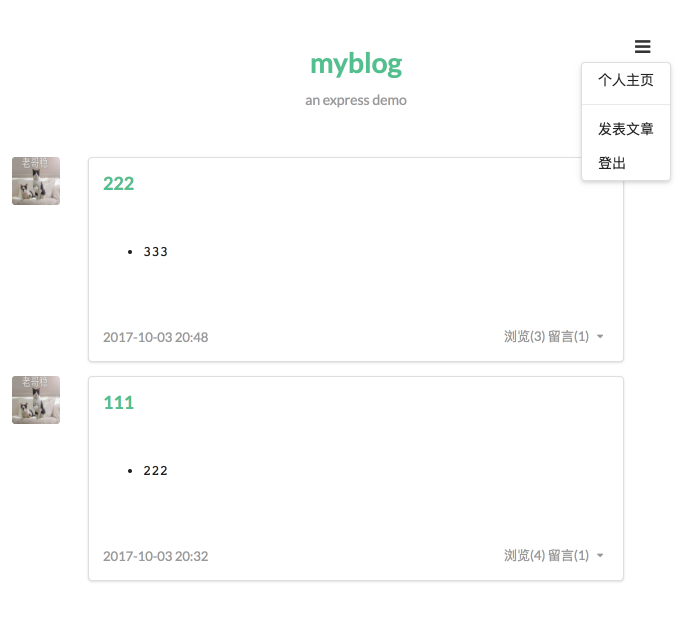
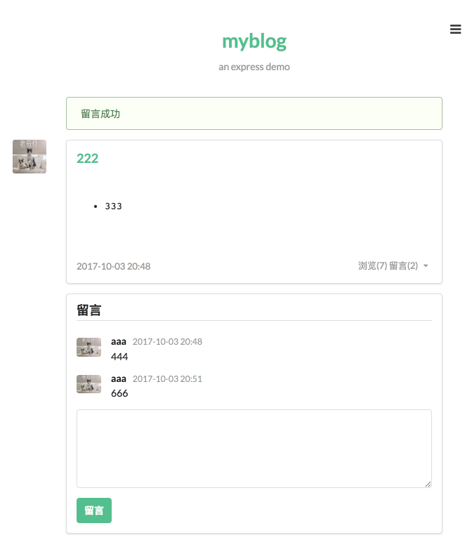

# Node Study

## Resources

- Boooks
  - BYVoid - *Node.js 开发指南*
  - 朴灵 - *深入浅出 Node.js*
- 网络资源
  - [Node Beginner](https://www.nodebeginner.org/index-zh-cn.html)
  - [N-blog](https://www.gitbook.com/book/maninboat/n-blog/details)
  - [阮一峰 - Express 框架](http://javascript.ruanyifeng.com/nodejs/express.html)
  - [Express](http://expressjs.com/)
  - [Express 中文](http://expressjs.jser.us/guide.html)

N-blog Demo：

[N-blog Code](../codes/myblog)
